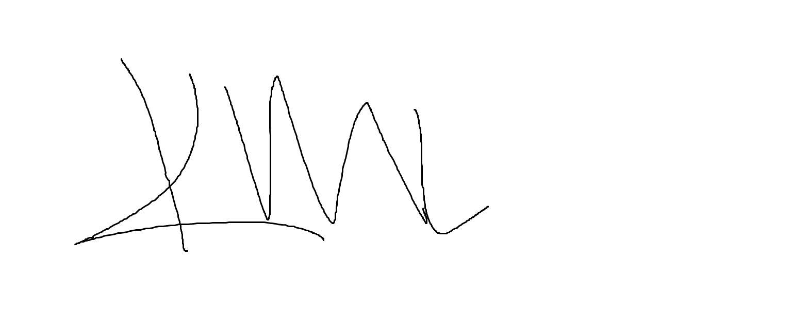

<!--Adapted from https://github.com/othneildrew/Best-README-Template/blob/master/README.md-->
<a name="readme-top"></a>

<!-- PROJECT SHIELDS -->
[](https://github.com/shkevin/KML/actions/workflows/build.yml)
[![Issues][issues-shield]][issues-url]
[![MIT License][license-shield]][license-url]
[![LinkedIn][linkedin-shield]][linkedin-url]

<!-- [![Contributors][contributors-shield]][contributors-url] -->
<!-- [![Forks][forks-shield]][forks-url] -->
<!-- [![Stargazers][stars-shield]][stars-url] -->

<!-- PROJECT LOGO -->
<br />
<div align="center">
  <a href="https://github.com/shkevin/KML">
    
  </a>

  <h3 align="center">KML</h3>

  <p align="center">
    Streaming machine learning framework.
    <br />
    <a href="https://github.com/shkevin/KML"><strong>Explore the docs »</strong></a>
    <br />
    <br />
    <a href="https://github.com/shkevin/KML/tools/python/notebooks">View Examples</a>
    ·
    <a href="https://github.com/shkevin/KML/issues">Report Bug</a>
    ·
    <a href="https://github.com/shkevin/KML/issues">Request Feature</a>
  </p>
</div>

<!-- TABLE OF CONTENTS -->
<details>
  <summary>Table of Contents</summary>
  <ol>
    <li>
      <a href="#about-the-project">About The Project</a>
      <ul>
        <li><a href="#built-with">Built With</a></li>
      </ul>
    </li>
    <li>
      <a href="#getting-started">Getting Started</a>
      <ul>
        <li><a href="#prerequisites">Prerequisites</a></li>
        <li><a href="#installation">Installation</a></li>
      </ul>
    </li>
    <li><a href="#usage">Usage</a></li>
    <li><a href="#roadmap">Roadmap</a></li>
    <li><a href="#contributing">Contributing</a></li>
    <li><a href="#license">License</a></li>
    <li><a href="#contact">Contact</a></li>
    <!-- <li><a href="#acknowledgments">Acknowledgments</a></li> -->
  </ol>
</details>

<!-- ABOUT THE PROJECT -->
## About The Project

The KML tool was developed for streaming machine learning (ML), and is implemented in C++11 and Python. The core framework was developed in C++
in order to achieve high performance, while Python is exposed through Cython compilation. Python was used in order to be easily adopted by
other researchers, data scientists, or machine learning engineers.

<p align="right">(<a href="#readme-top">back to top</a>)</p>

### Built With

KML was developed with these libraries and frameworks.

Frameworks

* [![C++][cpp-shield]][cpp-url]
* [![Python][python-shield]][python-url]
* [![Eigen3][eigen-shield]][eigen-url]

<p align="right">(<a href="#readme-top">back to top</a>)</p>

<!-- GETTING STARTED -->
## Getting Started

Follow the guidelines for building and installing KML.

### Requirements

Software used in building KML are listed below.

|Software       |Version                |Description                        |
|---------------|-----------------------|-----------------------------------|
|cmake          |3.14+                  |cmake for building project         |
|c++11 compiler |e.g., gnu c++, clang++ |kml uses c++11 for developed tools |
|cython         |0.29.24+               |cython version required to compile |
|python3        |3+                     |python version supported           |
|doxygen        |1.8.17+ (optional)     |for building c++ documentation     |
|gcovr          |4.2+    (optional)     |for creating c++ coverage          |

### Building

Common make commands are located in the Makefile.

Building KML can be accomplished by using cmake. See below for cmake options.

|Option              |Default |Description                        |
|--------------------|--------|-----------------------------------|
|CMAKE_BUILD_TYPE    |Debug   |Which build type to use            |
|BUILD_PYTHON        |OFF     |Compile Cython modules into Python |
|BUILD_COVERAGE      |OFF     |Create C++ code coverage report    |
|BUILD_DOCUMENTATION |OFF     |Build C++ documentation repot      |
|BUILD_TESTING       |OFF     |Build and run C++ unit tests       |

Example common build usage:

```bash
cmake \
    .. \
    -DCMAKE_BUILD_TYPE=Debug \
    -DBUILD_TESTING=ON \
    -DBUILD_PYTHON=ON \
    -DBUILD_COVERAGE=OFF \
    -DBUILD_DOCUMENTATION=OFF

make -j
```

### Installation

For installing the KML Python package:

Be sure to build the C++/Python with the example build above. After building, the Python package will be located
in the build/tools/packages directory. There will be a source distribution and a wheel distrubtion.

For installing the source distribution (tar.gz):

```bash
pip install KML-<MAJOR>.<MINOR>.<PATCH>.tar.gz
```

Where MAJOR, MINOR, and PATCH are from the current KML version.

For installing the wheel distribution (whl):

```bash
pip install KML-<MAJOR>.<MINOR>.<PATCH>-cp<PYVERSION>-cp<PYVERSION>m-<DIST>.whl
```

Where MAJOR, MINOR, and PATCH are from the current KML version. And where PYVERSION is the Python version
used to build the wheel, and DIST is the OS distribution used during build (e.g., linux).

<p align="right">(<a href="#readme-top">back to top</a>)</p>

<!-- USAGE EXAMPLES -->
## Usage

<p align="right">(<a href="#readme-top">back to top</a>)</p>

<!-- ROADMAP -->
## Roadmap

- [X] Basic summary statistics
- [X] Windowed data structures
- [ ] Neural Network Framework
	- [ ] Streaming Autoencoder

See the [open issues](https://github.com/shkevin/KML/issues) for a full list of proposed features (and known issues).

<p align="right">(<a href="#readme-top">back to top</a>)</p>

<!-- CONTRIBUTING -->
## Project leaders

Maintainers:

- [shkevin](https://github.com/shkevin)

Operations:

- [shkevin](https://github.com/shkevin)

<p align="right">(<a href="#readme-top">back to top</a>)</p>

<!-- CONTRIBUTING -->
## Contributing

If you have a suggestion that would make this better, please fork the repo and create a pull request.

1. Fork the Project
2. Create your Feature Branch
3. Commit your Changes
4. Push to the Branch
5. Open a Pull Request

<p align="right">(<a href="#readme-top">back to top</a>)</p>

<!-- LICENSE -->
## License

Distributed under the MIT License. See `LICENSE.txt` for more information.

<p align="right">(<a href="#readme-top">back to top</a>)</p>

<!-- CONTACT -->
## Contact

Kevin Cox - shk3vin7@gmail.com

Project Link: [https://github.com/shkevin/KML](https://github.com/shkevin/KML)

<p align="right">(<a href="#readme-top">back to top</a>)</p>

<!-- ACKNOWLEDGMENTS -->
<!-- ## Acknowledgments -->

<p align="right">(<a href="#readme-top">back to top</a>)</p>

<!-- MARKDOWN LINKS & IMAGES -->
[contributors-shield]: https://img.shields.io/github/contributors/shkevin/KML
[contributors-url]: https://github.com/shkevin/KML/graphs/contributors
[forks-shield]: https://img.shields.io/github/forks/shkevin/KML
[forks-url]: https://github.com/shkevin/KML/network/members
[stars-shield]: https://img.shields.io/github/stars/shkevin/shields
[stars-url]: https://github.com/shkevin/KML/stargazers
[issues-shield]: https://img.shields.io/github/issues/shkevin/KML
[issues-url]: https://github.com/shkevin/KML/issues
[license-shield]: https://img.shields.io/github/license/shkevin/KML
[license-url]: https://github.com/shkevin/KML/blob/master/LICENSE.txt
[linkedin-shield]: https://img.shields.io/badge/-LinkedIn-black.svg?color=Blue&style=social&logo=linkedin&colorB=555
[linkedin-url]: https://www.linkedin.com/in/kevin-cox-640334195/

[cpp-shield]: https://img.shields.io/badge/-C++11-00599C?logo=cplusplus&logoColor=white&style=flat?labelColor=black
[cpp-url]: https://isocpp.org/wiki/faq/cpp11
[python-shield]: https://img.shields.io/badge/-Python3-3776AB?logo=python&style=flat
[python-url]: https://www.python.org/
[eigen-shield]: https://img.shields.io/badge/-Eigen3-00599C?logo=cplusplus&logoColor=white&style=flat
[eigen-url]: https://eigen.tuxfamily.org/index.php?title=Main_Page
<!-- [product-screenshot]: images/screenshot.png -->
